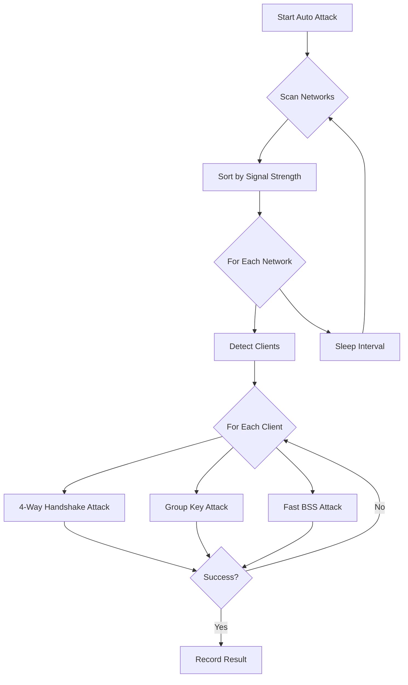

# KRACK Attack Tool 🔓


A Python-based tool for testing networks against Key Reinstallation Attacks (KRACK).

## 📁 Project Structure

```
krack_attack/
├── __init__.py              # Package initialization
├── krack_attacks.py         # Core attack implementations
├── krack_auto.py           # Automated attack functionality
├── krack_cli.py            # Command-line interface
├── krack_core.py           # Core utilities and logging
├── krack_network.py        # Network scanning and client detection
└── tests/                  # Test suite
    ├── __init__.py
    ├── test_attacks.py     # Attack function tests
    ├── test_auto.py       # Auto attack tests
    └── test_network.py    # Network utility tests
```

## ✨ Features

### Auto Attack Mode 🤖

The new auto attack mode automatically:
- Continuously scans for networks in range
- Prioritizes networks by signal strength
- Detects active clients on each network
- Attempts all supported attacks on vulnerable clients
- Tracks successful attacks and their results

### Attack Flow Diagram



## 🎯 Attack Feature Matrix

| Attack Type | Description | Auto Mode | Manual Mode | Success Rate |
|------------|-------------|:---------:|:-----------:|:------------:|
| 4-Way Handshake (Plaintext) | Reinstalls PTK with plaintext retransmission | ✅ | ✅ | High |
| 4-Way Handshake (Encrypted) | Reinstalls PTK with encrypted retransmission | ✅ | ✅ | Medium |
| Group Key (Immediate) | Immediate GTK reinstallation | ✅ | ✅ | High |
| Group Key (Delayed) | Delayed GTK reinstallation | ✅ | ✅ | Medium |
| Fast BSS Transition | FT Handshake exploitation | ✅ | ✅ | Medium |

## 🚀 Usage

### Auto Attack Mode

```bash
krack-attack auto --interface wlan0 --min-signal -70
```

Options:
- `--interface`: Network interface to use (must be in monitor mode)
- `--min-signal`: Minimum signal strength to consider (default: -70 dBm)
- `--attack-timeout`: Timeout for each attack attempt (default: 60s)
- `--scan-interval`: Time between network scans (default: 30s)

### Manual Attack Mode

```bash
krack-attack manual --interface wlan0 --bssid XX:XX:XX:XX:XX:XX --client YY:YY:YY:YY:YY:YY
```
### Tests

All tests passing


## 🛡️ Defense

To protect against KRACK attacks:
- Update all WiFi devices to the latest firmware
- Use WPA3 when possible
- Avoid using WPA2 without additional security measures
- Monitor network for suspicious retransmissions

## 📝 License

This project is licensed under the MIT License - see the LICENSE file for details.

## ⚠️ Disclaimer

This tool is for educational and testing purposes only. Do not use it against networks without explicit permission.
